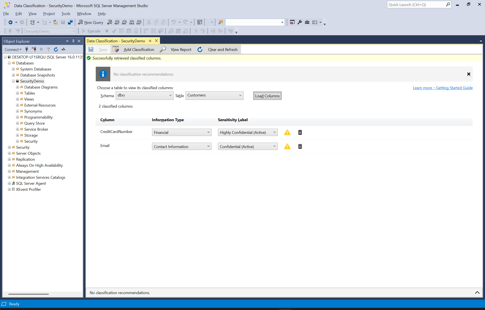

# SQL: Security and Compliance

## Use Case

The database administration team at a midsized organization must ensure that critical data is protected from unauthorized access, breaches, and noncompliance with regulatory standards. Key requirements include:

- **Data Protection**: Shield sensitive information from internal and external threats  
- **Network Isolation**: Restrict connectivity so that only approved users and systems access the databases  
- **Auditing and Monitoring**: Track security events, classify sensitive data, and monitor user activity to detect anomalies  
- **Operational Continuity**: Ensure systems remain secure and available during maintenance and emergencies  
- **Regulatory Compliance**: Meet legal and regulatory requirements

<!-- ------------------------- ------------------------- -->

## Fundamentals

### Platform Differences

#### **Azure SQL** Database
- **Managed Security**:  
  - Builtin threat detection and automated patching  
  - Limited direct configuration of underlying infrastructure  
- **Entra ID Integration**:  
  - Native support for Entra ID authentication simplifies identity management

#### **Azure SQL** Managed Instance
- **Hybrid Control**:  
  - Combines traditional SQL Server security features with Azure's managed environment  
  - Supports both TDE and Always Encrypted with advanced key management via Azure Key Vault  
- **Enhanced Auditing**:  
  - Offers robust audit capabilities that integrate with Azure Monitor and Log Analytics

#### SQL Server on Azure VMs
- **Full Control**:  
  - Apply traditional on-prem security hardening techniques  
  - Custom configuration of auditing, encryption, and network isolation  
- **Custom Security Solutions**:  
  - Integrate thirdparty tools or tailored configurations as required

<!-- ------------------------- ------------------------- -->

### Authentication
...confirms an identity

- **Windows**: Leverage domain credentials for secure, integrated access  
- **SQL Server**: Authenticate using SQL Server-specific credentials... suitable when Windows Authentication is not used  
- **MultiFactor**: Enforce a second verification step via Windows or Active Directory using smart cards or Entra ID multifactor authentication; note that multifactor authentication is not supported for SQL Server Authentication  
- **Entra ID Authentication**: centralize identity management using Entra ID for database access  
  - **SQL Server**: requires federation with Entra ID via Active Directory Federation Services (no native support)  
  - **Azure SQL**: configure an Entra ID administrator, create contained database users with FROM EXTERNAL PROVIDER, and enforce conditional access and multifactor policies  

<!-- ------------------------- ------------------------- -->

### Authorization
...controls what an identity can do

- **Role-Based**: A role is a **named group of permissions**
  - **SQL Server**: Has builtin roles such as data **reader**, data **writer**, and database **owner** 
  - **Windows**: Create a SQL Login corresponding to a Windows user or group
    - Assign that login to the appropriate SQL Server role
    - Upshot: Active Directory manages membership 
- **Row Level Security**: restrict access to table rows based on the executing user's context  
  - **SQL Server**: create an inline tablevalued function and enforce it via CREATE SECURITY POLICY ... ADD FILTER PREDICATE to apply rowlevel filters  
  - **Azure SQL**: use the same TSQL security policy approach, leveraging Entra ID principals or SESSION_CONTEXT to drive the filter logic

<!-- ------------------------- ------------------------- -->

#### Scope  
...defines what is secured by authorization

- **Server**: the entire SQL instance (logins, server roles)
  - **SQL Server**: physical instance with full server roles such as "sysadmin" and "serveradmin"
  - **Azure SQL**: logical server with limited builtin roles and an Entra ID administrator

- **Database**: a single database (database roles, settings)
  - **SQL Server**: supports Windows Authentication and SQL Server Authentication for logins
  - **Azure SQL**: uses contained database users and database-scoped roles only

- **Schema**: a group of objects in a database
  - **SQL Server** and **Azure SQL**: identical behavior for schema-scoped permissions

- **Object**: a table, view, or stored procedure
  - **SQL Server** and **Azure SQL**: identical behavior for object-level permissions

- **Column**: a field in a table (for example encryption or masking)
  - **SQL Server** and **Azure SQL**: identical behavior for column-level permissions

- **Row**: individual records (row-level security)
  - **SQL Server** and **Azure SQL**: both support security policies with FILTER PREDICATE definitions

- **Network**: client connections
  - **SQL Server**: relies on operatingsystem or network firewall rules and TCP port configuration
  - **Azure SQL**: uses Azure SQL firewall rules, virtual network service endpoints, and private endpoints with TLS enforced by default

<!-- ------------------------- ------------------------- -->

### Connectivity 
...restrict client connectivity using network controls  

- **Network Isolation**: configure firewalls, service endpoints, private endpoints, virtual network rules and VPNs  
  - **SQL Server**: manage Windows firewall rules or network ACLs to limit access to the database port  
  - **Azure SQL**: define server-level firewall rules, enable virtual network service endpoints or private endpoints  

<!-- ------------------------- ------------------------- -->

### Encryption  
...ensures data remains unreadable by unauthorized parties  

- **At Rest**: data stored on disk or in backups

  - **Transparent Data Encryption**: encrypts the entire database on disk  
    - **SQL Server**: create a database master key and certificate, then run ALTER DATABASE ... SET ENCRYPTION ON  
    - **Azure SQL**: enabled by default; manage keys via Azure Key Vault or use servicemanaged keys in the Azure portal

  - **Column-Level Encryption**: encrypts specific sensitive columns  
    - **SQL Server**: create a database master key, certificate, and symmetric key; use the ENCRYPTBYKEY and DECRYPTBYKEY functions in TSQL to secure column data  
    - **Azure SQL**: use the same TSQL encryption functions with keys managed in Azure Key Vault or servicemanaged keys, configured via the Azure portal or PowerShell  

- **In Transit**: data moving across the network  

  - **Transport Layer Security**: encrypts network traffic between client and server  
    - **SQL Server**: install a valid server certificate, enable "Force Encryption" in SQL Server Configuration Manager, and require clients to use Encrypt=True in their connection strings  
    - **Azure SQL**: TLS is enforced by default for all connections (minimum TLS 1.2); configure the minimum TLS version in the Azure portal under your SQL server's Security settings

  - **Secure Sockets Layer**: legacy protocol that also encrypts network traffic (superseded by TLS)  
    - **SQL Server**: older versions support SSL 3.0; enable or disable via SQL Server Configuration Manager or Windows registry, though it is disabled by default in recent releases for security  
    - **Azure SQL**: does not support SSL; any legacy SSL connection attempts are rejected and only TLS 1.2 or higher is allowed
 
- **In Use**: data loaded into memory for processing

  - **Always Encrypted**: encrypts sensitive columns on the client so SQL Server only ever sees encrypted data  
    - **SQL Server**: configure column master keys and column encryption keys using SQL Server Management Studio or PowerShell; enable clientside encryption by specifying Column Encryption Setting=Enabled in the connection string  
    - **Azure SQL**: integrate with Azure Key Vault for key management; enable Always Encrypted through the Azure portal or PowerShell and set Column Encryption Setting=Enabled in the connection string

    - **Encryption types**  
      - **Deterministic**: same plaintext always produces the same ciphertext, which lets you do equality joins and filters  
      - **Randomized**: produces different ciphertexts for the same plaintext, giving stronger protection but no support for searching or joining

- **Storage Encryption**: apply encryption at the storage layer to protect database files and backups at rest  
  - **SQL Server**: use BitLocker to encrypt volumes hosting database files and ensure backup targets reside on encrypted media  
  - **Azure SQL**: rely on Azure Storage Service Encryption, which automatically encrypts database files and backups using Microsoftmanaged or customermanaged keys in Azure Key Vault  

<!-- ------------------------- ------------------------- -->

#### Key Management  
...secure and rotate cryptographic keys that underpin encryption  

- **Key Management**: manage keys for database encryption features  
  - **SQL Server**: store keys in a database master key protected by a certificate or hardware security module via Extensible Key Management; rotate keys using ALTER MASTER KEY and certificate commands  
  - **Azure SQL**: integrate with Azure Key Vault for servicemanaged or customermanaged keys; configure rotation policies and access controls for Transparent Data Encryption and Always Encrypted  

<!-- ------------------------- ------------------------- -->

### Governance
...policies and controls to identify and protect sensitive data

- **Sensitivity Classification**: assign metadata to columns indicating their sensitivity  
  - **SQL Server**: use the sys.sp_add_sensitivity_classification stored procedure or SSMS Data Classification pane to label columns; query sys.sensitivity_classifications to review existing labels  
  - **Azure SQL**: run "Data discovery & classification" scans in the Azure portal or call sys.sp_add_sensitivity_classification via TSQL; view and manage labels in the portal or via sys.sensitivity_classifications  

- **Dynamic Data Masking**: define masking rules to obscure sensitive column data **at query time**  
  - **SQL Server**: use ALTER TABLE ... ALTER COLUMN ... ADD MASKED WITH (FUNCTION = 'default()' or custom functions); manage masks in SSMS under Security > Dynamic Data Masking  
  - **Azure SQL**: configure masks in the Azure portal "Dynamic Data Masking" blade or via the same TSQL ADD MASKED statements; supports default, email, and partial masks  

- **Microsoft Purview**: catalog and govern data assets with automated scanning and classification  
  - **SQL Server**: register onpremises instances with Purview and deploy the scanning integration to discover and classify sensitive data; review scan results and export compliance reports in the Purview portal  
  - **Azure SQL**: enable Purview scanning directly against Azure SQL servers in the portal; schedule recurring scans, validate or update classifications, and generate builtin compliance dashboards

- **Sensitivity Labels**: leverage Microsoft Information Protection to apply and enforce labels across databases and tables  
  - **SQL Server**: install and configure the Azure Information Protection scanner or use MIP PowerShell cmdlets to label onpremises databases registered with Purview  
  - **Azure SQL**: integrate with Microsoft Information Protection in the Azure portal or via PowerShell to apply sensitivity labels at scale and ensure metadata flows through downstream services  

<!-- ------------------------- ------------------------- -->

### Lifecycle Management  
...manage data retention, purging, and archival for compliance  

- **Retention Policies**: implement temporal tables or partition switching to expire data after a set period  
  - **SQL Server**: configure systemversioned temporal tables with HISTORY_RETENTION_PERIOD or use partition switching to archive old data  
  - **Azure SQL**: use temporal tables plus an Azure Automation runbook to clean up history or export snapshots to Blob storage  

- **Purge Jobs**: schedule deletion tasks to remove stale or expired data  
  - **SQL Server**: create SQL Server Agent jobs that run DELETE or EXEC stored procedures on a cadence  
  - **Azure SQL**: use Elastic Jobs or Azure Automation runbooks to execute purge scripts  

- **Archival**: move historical data to lowercost storage for longterm retention  
  - **SQL Server**: export data via BCP or PolyBase into Azure Blob or Data Lake  
  - **Azure SQL**: use Azure Data Factory or Elastic Query to offload data to Data Lake  

<!-- ------------------------- ------------------------- -->

### Observability

#### Auditing  
...record security-relevant events for accountability  

- **Auditing**: configure audit logs to capture actions such as schema changes, logins, and security policy modifications  
  - **SQL Server**: create a Server Audit and Server Audit Specification, target FILE or Windows Application log, then enable both  
  - **Azure SQL**: enable Azure SQL Auditing at the server or database scope in the portal or via PowerShell, and send logs to Log Analytics, Storage, or Event Hubs  

<!-- ------------------------- ------------------------- -->

#### Monitoring  
...logs, metrics, alerts used to understand activity and exceptions

- **Monitoring**: collect and review logs and metrics to understand normal activity  
  - **SQL Server**: query dynamic management views (for example, sys.dm_exec_sessions and sys.dm_os_wait_stats) to track server and session activity  
  - **Azure SQL**: use Azure Monitor (Log Analytics) to collect logs and metrics  
    - configure **alert logic threshold** to Dynamic for usage metrics
    - set **Threshold Sensitivity** to Low to only trigger on significant, sustained deviations

<!-- ------------------------- ------------------------- -->

#### Vulnerability Assessment  
...automated security scanning to identify misconfigurations, missing patches, and insecure settings  

- **Vulnerability Assessment**: builtin scans that detect security issues and insecure configurations  
  - **SQL Server**: run the builtin vulnerability assessment in SQL Server Management Studio or via TSQL, review results in the GUI  
  - **Azure SQL**: enable as part of Advanced Data Security on the server or database (portal or PowerShell) and view findings under the Vulnerability Assessment blade

- **Remediation**: actionable guidance and exportable scripts to fix detected issues  
  - **SQL Server**: generate exportable reports (Excel or PDF) and apply recommended fixes manually or via TSQL  
  - **Azure SQL**: download remediation scripts from the portal and automate remediation with Azure PowerShell or Azure CLI  

<!-- ------------------------- ------------------------- -->

#### Threat Detection  
...identify and alert on suspicious or malicious behavior  

- **Advanced Threat Protection**: builtin analytics that flag unusual activities before they become incidents  
  - **SQL Server**: deploy Extended Events and SQL Server Audit to capture and analyze suspect events  
  - **Azure SQL**: enable "Microsoft Defender for SQL" to flag unusual activities before they become incidents

- **Anomaly Detection**: automated identification of irregular patterns that may indicate threats  
  - **SQL Server**: run custom TSQL queries against dynamic management views or audit logs to spot patterns such as repeated login failures or unexpected queries  
  - **Azure SQL**: leverage anomaly detection in "Microsoft Defender for SQL" to automatically surface unusual behavior
 
- **Alerting**: mechanisms to notify stakeholders when potential threats are detected  
  - **SQL Server**: configure Database Mail and SQL Server Agent alerts to send notifications on threat events  
  - **Azure SQL**: create Azure Monitor alerts on threat detection logs to send emails, SMS, or trigger automated responses

<!-- ------------------------- ------------------------- -->

### Maintenance  
...regular activities to ensure continued security and compliance  

- **Audit Reviews**: schedule regular examination of audit logs and role memberships  
  - **SQL Server**: schedule SQL Server Agent jobs to export and review audit data via sys.fn_get_audit_file and check server role mappings  
  - **Azure SQL**: use Azure Automation runbooks or Logic Apps to retrieve audit logs from Azure Monitor and review databasescoped role assignments  

- **Permission Reviews**: periodically verify user and group access  
  - **SQL Server**: query sys.server_principals, sys.database_principals, and sp_helprotect with scheduled TSQL scripts  
  - **Azure SQL**: run PowerShell scripts against Entra ID and query contained database users to confirm assignments  

- **Patch Scheduling**: apply security updates on a defined cadence  
  - **SQL Server**: coordinate Windows Update or WSUS schedules with maintenance windows to apply SQL Server patches  
  - **Azure SQL**: configure maintenance windows and update control in the Azure portal  

- **Backup & Restore Tests**: validate backup and recovery procedures  
  - **SQL Server**: use maintenance plans or custom TSQL jobs to run BACKUP, RESTORE VERIFYONLY and test restores to sandbox instances  
  - **Azure SQL**: perform pointintime restores or database copies to test recovery workflows  

- **Security Drills**: conduct tabletop exercises and vulnerability scans regularly  
  - **SQL Server**: run the builtin vulnerability assessment in SQL Server Management Studio and simulate attack scenarios  
  - **Azure SQL**: leverage Microsoft Defender for SQL vulnerability assessment and simulate failover or breach exercises

<!-- ------------------------- ------------------------- -->

### Best Practices 
...recommended guidelines to establish and maintain a secure and compliant SQL environment

- **Access and Identity Management**  
  - **LeastPrivilege Principle**: grant **only the permissions each user needs** by using builtin roles and assigning them to users or Active Directory groups  
  - **Authentication Choice**: prefer **Windows Authentication** for domain users <s>and SQL Authentication for service or nondomain accounts</s>

- **Data Protection**  
  - **Encryption Everywhere**: enforce encryption at rest, in transit, and in use  
  - **Surface Area Reduction**: disable unused features, services, and ports  

- **Maintenance and Compliance**  
  - **Patch Management**: schedule and apply operating system and SQL Server security updates on a defined cadence  
  - **Regular Permission Reviews**: audit role memberships and login mappings on a schedule to verify access remains appropriate  
  - **Regular Audits & Reviews**: schedule log and policy reviews to ensure ongoing compliance  
  - **Periodic Security Assessments**: run penetration tests and vulnerability scans regularly  
  - **Incident Response Planning**: develop and test clear recovery and response plans  

- **Governance and Automation**  
  - **Automated Enforcement**: use "Azure Policy" to automatically remediate noncompliant SQL resources  
  - **Policy Documentation**: maintain and update security policies to support audits and regulatory oversight  
  - **Industry Benchmark Hardening**: apply guides from the Center for Internet Security and other standards

<!-- ------------------------- ------------------------- -->

### Compliance

Common regulatory frameworks influencing SQL security design include:

- **General Data Protection Regulation (GDPR)**: European Union regulation protecting personal data and privacy  
- **Health Insurance Portability and Accountability Act (HIPAA)**: United States law safeguarding patient health information  
- **Payment Card Industry Data Security Standard (PCIDSS)**: Industry standards for protecting credit and debit card data  
- **SarbanesOxley Act (SOX)**: United States law enforcing strict financial reporting and internal controls to prevent fraud

The table below maps key SQL implementations to major regulatory frameworks:

| Compliance Requirement | Relevant SQL Features | Notes |
| :--- | :--- | :--- |
| GDPR (Article 32): Protect personal data at rest and in transit | Transparent Data Encryption, Always Encrypted, TLS Enforcement | TDE encrypts stored data, Always Encrypted protects sensitive columns, TLS secures network traffic |
| HIPAA (164.312(a)): Access control | Role-Based Access Control (RBAC), Row-Level Security, Entra ID Authentication | Enforces identity verification and restricts access based on user roles and context |
| HIPAA (164.312(b)): Audit controls | SQL Server Audit, Azure SQL Auditing | Captures security events, data access, and schema modifications for accountability |
| PCI-DSS (Requirement 3.4): Protect stored cardholder data | Dynamic Data Masking, Always Encrypted, Column-Level Encryption | Masks sensitive data in query results and encrypts critical fields |
| PCI-DSS (Requirement 10.2): Audit access to cardholder data | SQL Server Audit, Azure SQL Auditing to Log Analytics | Records access to sensitive data and critical system activities |
| SOX (Section 404): Internal control over financial reporting | Auditing, Role-Based Access Control, Multi-Factor Authentication | Enables traceability, enforces least privilege, and secures authentication flows |

The use of these controls supports audit readiness and reduces compliance risk by aligning SQL security configurations with external regulatory obligations.

<!-- ------------------------- ------------------------- -->

### Quiz

1. Which statement best distinguishes authentication from authorization?  
    A) Authentication grants permissions; authorization verifies identity  
    B) Authentication verifies identity; authorization grants permissions  
    C) Authentication and authorization are the same process  
    D) Authentication encrypts data; authorization masks data  

2. What is the primary benefit of rowlevel security?  
    A) It encrypts individual columns within a table  
    B) It masks sensitive data at query time  
    C) It filters rows so users see only the data they are allowed to view  
    D) It audits user activity on a perrow basis  

3. Which statement best describes the role of Transparent Data Encryption?  
    A) It masks data for unauthorized users  
    B) It encrypts data at rest to protect physical files and backups  
    C) It enforces multifactor authentication  
    D) It classifies sensitive data for reporting  

4. Which concept is unique to Always Encrypted compared with other encryption methods?  
    A) It encrypts network traffic between client and server  
    B) It provides disklevel encryption managed by the operating system  
    C) It encrypts data on the client so the database engine only sees ciphertext  
    D) It rotates encryption keys automatically without user intervention  

5. What is the conceptual purpose of dynamic data masking?  
    A) To obscure sensitive values at query time for unauthorized users  
    B) To encrypt data in transit  
    C) To classify columns by sensitivity level  
    D) To enforce firewall rules on client connections  

6. What does sensitivity classification enable?  
    A) Realtime anomaly detection on queries  
    B) Tagging of data with metadata to drive protection and reporting  
    C) Automatic purging of old data based on labels  
    D) Encryption of backups using Azure Key Vault  

7. Which statement best describes network isolation?  
    A) It encrypts data at rest  
    B) It audits user activity across networks  
    C) It classifies network traffic by sensitivity  
    D) It restricts client connectivity using firewalls, endpoints, and VPNs  

8. What is the primary purpose of auditing in SQL environments?  
    A) To record security-relevant events for accountability and compliance  
    B) To automatically remediate misconfigurations  
    C) To mask data for unauthorized users  
    D) To enforce rowlevel security policies  

9. How does anomaly detection support threat detection?  
    A) It enforces encryption at rest  
    B) It schedules periodic vulnerability scans  
    C) It applies sensitivity labels automatically  
    D) It identifies unusual patterns or behaviors that may indicate a threat  

10. Which best describes the difference between continuous monitoring and scheduled reviews?  
    A) Continuous monitoring uses manual audits; scheduled reviews use automated tools  
    B) Continuous monitoring collects realtime metrics and alerts; scheduled reviews conduct periodic manual inspections  
    C) Continuous monitoring rotates encryption keys; scheduled reviews purge old data  
    D) Continuous monitoring encrypts data in transit; scheduled reviews classify sensitive data  

<!-- ------------------------- ------------------------- -->

#### Answers

1. **B** - Authentication verifies identity; authorization grants permissions  
   *Authentication confirms who you are, while authorization determines what you can do once identified.*

2. **C** - It filters rows so users see only the data they are allowed to view  
   *Rowlevel security applies predicates so each user sees only their permitted subset of data.*

3. **B** - It encrypts data at rest to protect physical files and backups  
   *Transparent Data Encryption secures data on disk and in backups without changing application code.*

4. **C** - It encrypts data on the client so the database engine only sees ciphertext  
   *Always Encrypted ensures sensitive values are encrypted before reaching the server, preventing administrators from viewing plaintext.*

5. **A** - To obscure sensitive values at query time for unauthorized users  
   *Dynamic Data Masking replaces actual data with masked output in query results for users lacking unmasking privileges.*

6. **B** - Tagging of data with metadata to drive protection and reporting  
   *Sensitivity classification labels columns or tables, enabling governance tools and reports to identify highrisk data.*

7. **D** - It restricts client connectivity using firewalls, endpoints, and VPNs  
   *Network isolation limits access at the network layer, ensuring only approved paths and addresses can reach the database.*

8. **A** - To record security-relevant events for accountability and compliance  
   *Auditing captures actions like logins, schema changes, and policy modifications for later review and evidence.*

9. **D** - It identifies unusual patterns or behaviors that may indicate a threat  
   *Anomaly detection spots deviations from normal activity—such as repeated failures or odd queries—that warrant investigation.*

10. **B** - Continuous monitoring collects realtime metrics and alerts; scheduled reviews conduct periodic manual inspections  
   *Continuous monitoring provides ongoing visibility through metrics and alerts, while scheduled reviews involve deliberate, regular audits of logs and configurations.*

<!-- ------------------------- ------------------------- ------------------------- ------------------------- -->

## OnPrem

### Exercises

#### Prepare Resources

This exercise assumes a machine with:
* SQL Server (hybrid Windows Authentication and SQL Authentication)
* SQL Server Management Studio

Open SQL Server Configuration Manager >> SQL Server Services and confirm that the SQL Server (MSSQLSERVER) service is running.

Launch SQL Server Management Studio, connect to localhost, and then click "New Query".  

Create a demonstration database:
```sql
CREATE DATABASE SecurityDemo;
```

Switch to the demonstration database:
```sql
USE SecurityDemo;
```

#### Exercise #1: [Row-Level Security](https://learn.microsoft.com/en-us/sql/relational-databases/security/row-level-security?view=sql-server-ver16)
...enforces finegrained access control by limiting which rows in a table a given user can see or modify, restricting data at the row level based on the caller's identity or context rather than granting or denying access to the entire table.

##### How?  
- Uses an **inline tablevalued function** that returns a result set of allowed rows
- Binds that function to a security policy  
- Then, SQL Server automatically:
  - Applies the predicate logic to SELECT, UPDATE, and DELETE operations (**filter predicates**) 
  - Enforces it on INSERT, UPDATE, and DELETE operations (**block predicates**)

##### Why functions?  
- **Modularity**: encapsulate filter logic in one place
- **Performance**: can be inlined by the query optimizer, minimizing overhead
- **Flexibility**: create multiple predicates without altering the security policy definition

<!-- ------------------------- ------------------------- -->

##### Let's get started!

Create sample table:
```sql
CREATE TABLE dbo.EmployeeData ( Id INT IDENTITY PRIMARY KEY, Name NVARCHAR(100), OwnerLogin SYSNAME );
```

Insert sample data:
```sql
INSERT INTO dbo.EmployeeData (Name, OwnerLogin) VALUES ('Alice', 'user1'),('Bob',   'user2');
```

Create logins:
```sql
CREATE LOGIN user1 WITH PASSWORD = '<password>';
CREATE LOGIN user2 WITH PASSWORD = '<password>';
```

Create users:
```sql
CREATE USER user1 FOR LOGIN user1;
CREATE USER user2 FOR LOGIN user2;
```

Grant `SELECT` permissions:
```sql
GRANT SELECT ON dbo.EmployeeData TO user1;
GRANT SELECT ON dbo.EmployeeData TO user2;
```

Create function:
```sql
CREATE FUNCTION dbo.fn_securitypredicate(@OwnerLogin SYSNAME) 
RETURNS TABLE
WITH SCHEMABINDING AS
  RETURN SELECT 1 AS fn_result
  WHERE @OwnerLogin = USER_NAME();
```

Create security policy:
```sql
CREATE SECURITY POLICY dbo.EmployeeFilter
  ADD FILTER PREDICATE dbo.fn_securitypredicate(OwnerLogin) ON dbo.EmployeeData
  WITH (STATE = ON);
```

Verify enforcement for `user1`:
```sql
EXECUTE AS USER = 'user1';
SELECT * FROM dbo.EmployeeData;
REVERT;
```

Expected output: Alice's row

Verify enforcement for `user2`:
```sql
EXECUTE AS USER = 'user2';
SELECT * FROM dbo.EmployeeData;
REVERT;
```

Expected output: Bob's row

##### Final Thought  
Rowlevel security is a powerful way to enforce access boundaries directly within the database engine, ensuring that users see only the data they are meant to see—even when querying the same table. By combining simple user mappings with a reusable predicate function, policies can be implemented cleanly and maintained consistently without modifying application code or duplicating data across tables.

------------------------- -------------------------

#### Exercise #2: [Sensitivity Classification](https://learn.microsoft.com/en-us/sql/t-sql/statements/add-sensitivity-classification-transact-sql?view=sql-server-ver16)
...marks columns with metadata indicating their sensitivity so that reporting, masking, encryption, and compliance tools can identify and protect highrisk data

##### How?  
- Assigns each column a sensitivity label, information type, and classification level  
- Persists classification details in the system catalog for consistent retrieval and reporting  
- Triggers automated workflows that:  
  - surface labels in management interfaces  
  - generate compliance reports and enforce labeling policies  
  - provide guidance on masking and encryption based on classifications

##### Assignment Methods

- **Data Definition Language (DDL) Syntax**
  <br>Example: `ADD SENSITIVITY CLASSIFICATION`
  - Metadata is embedded **directly in the table definition**  
  - Aligns with schemaascode workflows and versioncontrolled deployment scripts  
  - Changes appear alongside other schema updates in code reviews and history  

- **System Stored Procedure**
  <br>Example: `sys.sp_add_sensitivity_classification` 
  - Labels multiple tables or columns in bulk through a single script  
  - Applies classifications **without altering existing table definition**s  
  - Can be scheduled or automated to keep labels up to date regularly

<!-- ------------------------- ------------------------- -->

##### Let's get started!

Create sample table:
```sql
CREATE TABLE dbo.Customers ( Id INT IDENTITY PRIMARY KEY, Email NVARCHAR(256), CreditCardNumber NVARCHAR(50) );
```

Insert sample data:
```sql
INSERT INTO dbo.Customers (Email, CreditCardNumber)
VALUES ('alice@example.com','4111-1111-1111-1111'), ('bob@example.com','5500-0000-0000-0004');
```

Classify `Email` column; special notes:
- Only one classification can be added to a single object; adding a classification to an object that is already classified overwrites the existing classification
- LABEL: human-readable, arbitrary value<br>
- INFORMATION_TYPE: human-readable, arbitrary value<br>
- RANK: pre-defined values include 1) NONE, 2) LOW, 3) MEDIUM, 4) HIGH, and 5) CRITICAL  

```sql
ADD SENSITIVITY CLASSIFICATION TO dbo.Customers.Email
WITH ( LABEL = 'Confidential', INFORMATION_TYPE = 'Contact Information', RANK = HIGH );
```

Classify `CreditCardNumber` column:  
```sql
ADD SENSITIVITY CLASSIFICATION TO dbo.Customers.CreditCardNumber
WITH ( LABEL = 'Highly Confidential', INFORMATION_TYPE = 'Financial', RANK = CRITICAL );
```

Confirm classification metadata:
```sql
SELECT 
    s.name AS SchemaName,
    o.name AS TableName,
    c.name AS ColumnName,
    sc.label AS Label,
    sc.information_type AS InformationType,
    sc.rank_desc AS Rank
FROM sys.sensitivity_classifications sc
	JOIN sys.objects o ON sc.major_id = o.object_id
	JOIN sys.columns c ON sc.major_id = c.object_id AND sc.minor_id = c.column_id
	JOIN sys.schemas s ON o.schema_id = s.schema_id
```  

Launch SQL Server Management Studio, rightclick the `SecurityDemo` database, then click Tasks → Data Discovery and Classification → Classify Data.



Select the `Customers` table, click "Load Columns" and verify the new labels on `CreditCardNumber` and `Email`.

##### Final Thought
Classification by itself does not change data or enforce anything; it is simply metadata that can be used to:
- **Recommend masking** for sensitive columns using Data Classification UI  
- **Flag highranked columns for encryption** (Always Encrypted or columnlevel)  
- **Prioritize audit coverage** for labeled data using SQL Server Audit  
- Filter or postprocess audit logs to focus on classified columns  
- **Generate compliance reports** showing classification coverage  
- Track classification status as part of governance or risk assessments  
- **Integrate with Microsoft Purview** to centralize sensitivity metadata  
- Use classifications to **guide retention, purging, or archival rules**  
- **Inform downstream systems** (BI, ETL, analytics) about data sensitivity  
- Support manual or automated review of label assignments over time

------------------------- -------------------------

#### [Dynamic Data Masking](https://learn.microsoft.com/en-us/sql/relational-databases/security/dynamic-data-masking)  
...obscures sensitive column values in query results for users who are not authorized to view the underlying data

##### How?  
- Adds masking rules to sensitive columns  
- Applies masking automatically at query time without modifying actual data  
- Enforced at the engine level and 
- Masked data visible only to users with UNMASK permission

##### Let's get started!

Mask `Email` column:
```sql
ALTER TABLE dbo.Customers
ALTER COLUMN Email
ADD MASKED WITH (FUNCTION = 'partial(1,"****@****",1)');
```

Mask `CreditCardNumber` column:
```sql
ALTER TABLE dbo.Customers
ALTER COLUMN CreditCardNumber
ADD MASKED WITH (FUNCTION = 'partial(0,"XXXX-XXXX-XXXX-",4)');
```

Create a login and user with SELECT permission only:
```sql
CREATE LOGIN dmLogin WITH PASSWORD = '<password>';
CREATE USER dmUser FOR LOGIN dmLogin;
GRANT SELECT ON dbo.Customers TO dmUser;
```

Test masking behavior:
```sql
EXECUTE AS USER = 'dmUser';
SELECT Email, CreditCardNumber FROM dbo.Customers;
REVERT;
```

Expected output:
```plaintext
Email             | CreditCardNumber
------------------|---------------------
a****@****m       | XXXX-XXXX-XXXX-1111
b****@****m       | XXXX-XXXX-XXXX-0004
```

##### Final Thought

Masking does not protect data from privileged users—it's a displaylevel control. To ensure masking is effective:  
- Avoid granting the **UNMASK** permission to application users  
- Combine masking with classification, auditing, and rolebased access control  
- Use it to protect casual exposure in shared environments, dashboards, and support tools

------------------------- -------------------------

### Quiz

1. What must be created to enforce rowlevel security on a table?  
   A) A security policy bound to a tablevalued function  
   B) A view that filters users by role  
   C) A CHECK constraint on the user name  
   D) A stored procedure with SELECT filters  

2. In the RLS exercise, which function controlled row access?  
   A) SUSER_SNAME()  
   B) ORIGINAL_LOGIN()  
   C) USER_NAME()  
   D) SYSTEM_USER()  

3. What behavior does sensitivity classification provide by itself?  
   A) Obscures data in query results  
   B) Tags columns with encryption keys  
   C) Blocks updates to classified tables  
   D) Adds metadata for reporting and governance  

4. Which catalog view lists all sensitivity classifications in the current database?  
   A) sys.columns  
   B) sys.sensitivity_classifications  
   C) sys.dm_exec_classifications  
   D) sys.objects  

5. What is a key advantage of using the DDL `ADD SENSITIVITY CLASSIFICATION`?  
   A) Updates values based on user role  
   B) Grants SELECT permissions to classified users  
   C) Embeds metadata directly in the table definition  
   D) Disables access to unclassified columns  

6. Which permission allows a user to bypass masking and see original data?  
   A) SELECT  
   B) INSERT  
   C) EXECUTE  
   D) UNMASK  

7. What does dynamic data masking do during query execution?  
   A) Obscures values in the result set for users without UNMASK  
   B) Encrypts result set data at rest  
   C) Prevents DML operations on masked columns  
   D) Logs masked queries to the audit trail  

8. Why was the separate login `dmLogin` used in the masking exercise?  
   A) To demonstrate masked results for a nonprivileged user  
   B) To simulate an administrative user  
   C) To configure backup encryption policies  
   D) To validate role membership for encryption keys  

9. What protection does Transparent Data Encryption (TDE) provide?  
   A) Hides query output from unauthorized users  
   B) Secures connections with TLS  
   C) Encrypts database files and backups at rest  
   D) Enforces rowlevel security filters  

10. How is masking different from encryption?  
   A) Masking is applied only to query output  
   B) Masking modifies data on disk  
   C) Masking removes rows from result sets  
   D) Masking changes data types during transformation  

<!-- ------------------------- ------------------------- -->

#### Answers

1. **A** - A security policy bound to a tablevalued function  
   *Rowlevel security requires a predicate function in a security policy to enforce perrow visibility.*

2. **C** - USER_NAME() returns the database user name in the current execution context  
   *USER_NAME() is used inside the predicate function to match the executing user to the OwnerLogin column, ensuring rows are filtered correctly.*

3. **D** - Adds metadata for reporting and governance about sensitive columns  
   *Sensitivity classification attaches labels to columns, enabling tools and reports to identify and protect highrisk data.*

4. **B** - sys.sensitivity_classifications holds classification metadata  
   *This catalog view stores labels, information types, and ranks for each classified column.*

5. **C** - Embeds metadata directly in the table definition for transparency and version control  
   *DDLbased classification ensures classification statements are part of schema scripts and appear in version history.*

6. **D** - UNMASK permission allows bypassing dynamic masks to view actual data  
   *Granting UNMASK enables authorized users to see full, unmasked column values while others see masked output.*

7. **A** - Obscures values in the result set for users without UNMASK  
   *Dynamic data masking automatically replaces sensitive values in query output for users lacking the UNMASK permission.*

8. **A** - To demonstrate masked results for a nonprivileged user  
   *Creating a separate login showed how dynamic data masking affects results for typical users without elevated permissions.*

9. **C** - Encrypts database files and backups at rest to protect dataatrest  
   *Transparent Data Encryption secures physical database files and backup sets, preventing offline data exposure.*

10. **A** - Masking affects only query output; encryption secures stored and transmitted data  
   *Masking controls what appears in result sets, whereas encryption protects data both at rest and in transit.*

<!-- ------------------------- ------------------------- ------------------------- ------------------------- -->

## Azure

### Exercise

**Objective**: Build a hardened Azure SQL environment showcasing network isolation, Entra ID integration, threat protection, and centralized auditing using Azure PowerShell  

<!-- ------------------------- ------------------------- -->

#### Let's get started!

Open Azure Portal >> Cloud Shell and switch to PowerShell.

##### Select Subscription
```powershell
Select-AzSubscription -SubscriptionId "<subscriptionid>"
```

Expected output:
```plaintext
Tenant: <tenantid>

SubscriptionName  SubscriptionId Account Environment
---------------- -------------- ------- -----------
<subscriptionname> <subscriptionid> <account> AzureCloud
```

##### Create Resource Group  
```powershell
New-AzResourceGroup -Name {prefix}rg -Location westus
```

Expected output:
```plaintext
ResourceGroupName : {prefix}rg
Location          : westus
ProvisioningState : Succeeded
Tags              : 
ResourceId        : /subscriptions/<subscriptionid>/resourceGroups/{prefix}rg
```

##### Create Log Analytics Workspace 
```powershell
New-AzOperationalInsightsWorkspace -ResourceGroupName {prefix}rg -Name {prefix}la -Location westus -Sku PerGB2018
```

Expected output:
```plaintext
Name                                : {prefix}la
ResourceId                          : /subscriptions/<subscriptionid>/resourceGroups/{prefix}rg/providers/Microsoft.OperationalInsights/workspaces/pref
                                      ixla
ResourceGroupName                   : {prefix}rg
Location                            : westus
Tags                                : {}
Sku                                 : PerGB2018
CapacityReservationLevel            : 
LastSkuUpdate                       : 04/18/2025 16:13:48
retentionInDays                     : 30
CustomerId                          : <customerid>
ProvisioningState                   : Succeeded
PublicNetworkAccessForIngestion     : Enabled
PublicNetworkAccessForQuery         : Enabled
PrivateLinkScopedResources          : 
WorkspaceCapping                    : Microsoft.Azure.Management.OperationalInsights.Models.WorkspaceCapping
CreatedDate                         : 04/18/2025 16:13:48
ModifiedDate                        : 04/18/2025 16:13:52
ForceCmkForQuery                    : 
WorkspaceFeatures                   : Microsoft.Azure.Commands.OperationalInsights.Models.PSWorkspaceFeatures
DefaultDataCollectionRuleResourceId : 
```

##### Create SQL Server 
```powershell
$cred = Get-Credential -Message "Enter SQL admin credentials" -UserName "sqladmin"
New-AzSqlServer -ResourceGroupName {prefix}rg -ServerName {prefix}ss -Location westus -SqlAdministratorCredentials $cred
```

Expected output:
```plaintext
ResourceGroupName             : {prefix}rg
ServerName                    : {prefix}ss
Location                      : westus
SqlAdministratorLogin         : sqladmin
SqlAdministratorPassword      : 
ServerVersion                 : 12.0
Tags                          : 
Identity                      : 
FullyQualifiedDomainName      : {prefix}ss.database.windows.net
ResourceId                    : /subscriptions/<subscriptionid>/resourceGroups/{prefix}rg/providers/Microsoft.Sql/servers/{prefix}ss
MinimalTlsVersion             : 1.2
PublicNetworkAccess           : Enabled
RestrictOutboundNetworkAccess : Disabled
Administrators                : 
PrimaryUserAssignedIdentityId : 
KeyId                         : 
FederatedClientId             : 
```

##### Create Sample Database 
```powershell
New-AzSqlDatabase -ResourceGroupName {prefix}rg -ServerName {prefix}ss -DatabaseName {prefix}sd -RequestedServiceObjectiveName "S0"
```

Expected output:
```plaintext
ResourceGroupName                : {prefix}rg
ServerName                       : {prefix}ss
DatabaseName                     : {prefix}sd
Location                         : westus
DatabaseId                       : 419724c7-5e04-43d0-a197-d408967ec1c6
Edition                          : Standard
CollationName                    : SQL_Latin1_General_CP1_CI_AS
CatalogCollation                 : 
MaxSizeBytes                     : 268435456000
Status                           : Online
CreationDate                     : 4/18/2025 4:19:42 PM
CurrentServiceObjectiveId        : 00000000-0000-0000-0000-000000000000
CurrentServiceObjectiveName      : S0
RequestedServiceObjectiveName    : S0
RequestedServiceObjectiveId      : 
ElasticPoolName                  : 
EarliestRestoreDate              : 
Tags                             : 
ResourceId                       : /subscriptions/<subscriptionid>/resourceGroups/{prefix}rg/providers/Microsoft.Sql/servers/{prefix}ss/databases/{prefix}s
                                   d
CreateMode                       : 
ReadScale                        : Disabled
ZoneRedundant                    : False
Capacity                         : 10
Family                           : 
SkuName                          : Standard
LicenseType                      : 
AutoPauseDelayInMinutes          : 
MinimumCapacity                  : 
ReadReplicaCount                 : 
HighAvailabilityReplicaCount     : 
CurrentBackupStorageRedundancy   : Geo
RequestedBackupStorageRedundancy : Geo
SecondaryType                    : 
MaintenanceConfigurationId       : /subscriptions/<subscriptionid>/providers/Microsoft.Maintenance/publicMaintenanceConfigurations/SQL_Default
EnableLedger                     : False
PreferredEnclaveType             : 
PausedDate                       : 
ResumedDate                      : 
Identity                         : 
EncryptionProtector              : 
Keys                             : 
FederatedClientId                : 
EncryptionProtectorAutoRotation  : 
UseFreeLimit                     : 
FreeLimitExhaustionBehavior      : 
ManualCutover                    : 
PerformCutover                   :
```

##### Create Firewall Rule
```powershell
New-AzSqlServerFirewallRule -ResourceGroupName {prefix}rg -ServerName {prefix}ss -FirewallRuleName AllowMyIP -StartIpAddress <ipaddress> -EndIpAddress <ipaddress>
```

Expected output:
```plaintext
ResourceGroupName : {prefix}rg
ServerName        : {prefix}ss
StartIpAddress    : <ipaddress>
EndIpAddress      : <ipaddress>
FirewallRuleName  : AllowMyIP
```

##### Set Administrator
```powershell
Set-AzSqlServerActiveDirectoryAdministrator -ResourceGroupName {prefix}rg -ServerName {prefix}ss -DisplayName "<myuser_principalname>" -ObjectId "<myuser_objectid>"
```

Expected output:
```plaintext
ResourceGroupName           : {prefix}rg
ServerName                  : {prefix}ss
DisplayName                 : <myuser_principalname>
ObjectId                    : <myuser_objectid>
IsAzureADOnlyAuthentication : 
```

##### Enable Advanced Threat Protection
```powershell
Update-AzSqlServerAdvancedThreatProtectionSetting -ResourceGroupName "{prefix}rg" -ServerName "{prefix}ss"
```

Expected output:
```plaintext
cmdlet Update-AzSqlServerAdvancedThreatProtectionSetting at command pipeline position 1
Supply values for the following parameters:
(Type !? for Help.)
Enable: yes
```

<!-- ------------------------- ------------------------- -->

### Quiz

1. What is the role of a firewall rule in Azure SQL Server?  
   A) It encrypts client connections  
   B) It assigns public IPs to databases  
   C) It restricts network access to specific IP ranges  
   D) It disables internal logging  

2. What is the purpose of creating a Log Analytics workspace in this lab?  
   A) To host SQL databases  
   B) To serve as the private DNS zone  
   C) To store and centralize audit logs  
   D) To run SQL queries across regions  

3. Which Azure identity feature was used to assign a centralized administrator to the SQL Server?  
   A) SQL Server login  
   B) Azure RBAC  
   C) Entra ID administrator  
   D) Managed Identity  

4. What happens when `Update-AzSqlServerAdvancedThreatProtectionSetting` is executed in the lab?  
   A) TDE is enabled on all databases  
   B) A vulnerability assessment is triggered  
   C) Threat detection is enabled on the SQL Server  
   D) Connection strings are regenerated  

5. What must be supplied when creating the Azure SQL Server using PowerShell?  
   A) A Log Analytics Workspace ID  
   B) A network security group  
   C) Administrator credentials  
   D) A SQL script file  

6. Why is `Get-Credential` used before creating the SQL Server?  
   A) To retrieve a private key for the workspace  
   B) To generate an MFA token  
   C) To securely prompt for and store the SQL admin login  
   D) To validate the server name  

7. Which Azure SQL feature restricts public access while allowing internal VNet traffic only?  
   A) Server firewall rules  
   B) Private Endpoint  
   C) Defender for SQL  
   D) Geo-replication  

8. What does the `RequestedServiceObjectiveName "S0"` parameter do during database creation?  
   A) Sets encryption level to Standard  
   B) Applies masking to system views  
   C) Defines performance tier for compute and storage  
   D) Enables support for failover groups  

9. What cmdlet replaces the deprecated `Set-AzSqlServerThreatDetectionPolicy`?  
   A) Enable-AzSqlThreatProtection  
   B) Update-AzSqlServerAdvancedThreatProtectionSetting  
   C) Set-AzSqlServerSecurityAlert  
   D) Add-AzThreatDetectionBinding  

10. Why is selecting the correct subscription at the beginning of the lab important?  
   A) It speeds up provisioning time  
   B) It applies a resource lock to the group  
   C) It ensures resources are created in an accessible, authorized context  
   D) It links all resources to a managed disk  

<!-- ------------------------- ------------------------- -->

### Answers

1. **C** - It restricts network access to specific IP ranges  
   *Firewall rules control which IPs are allowed to reach the Azure SQL endpoint.*

2. **C** - To store and centralize audit logs  
   *The Log Analytics workspace is used to collect and store diagnostic logs.*

3. **C** - Entra ID administrator  
   *This identity is assigned at the server level to allow Azure AD-based login.*

4. **C** - Threat detection is enabled on the SQL Server  
   *This cmdlet turns on Microsoft Defender for SQL at the server level.*

5. **C** - Administrator credentials  
   *Admin login and password are required when provisioning a SQL server.*

6. **C** - To securely prompt for and store the SQL admin login  
   *Get-Credential collects and passes login info securely to the cmdlet.*

7. **B** - Private Endpoint  
   *Private Endpoints remove public IP exposure and route traffic through the VNet.*

8. **C** - Defines performance tier for compute and storage  
   *S0 specifies a standard tier with specific DTU and storage limits.*

9. **B** - Update-AzSqlServerAdvancedThreatProtectionSetting  
   *This cmdlet replaced the older threat detection policy command.*

10. **C** - It ensures resources are created in an accessible, authorized context  
   *Without switching to the correct subscription, permissions and visibility may block deployment.*
